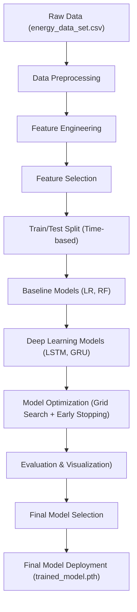
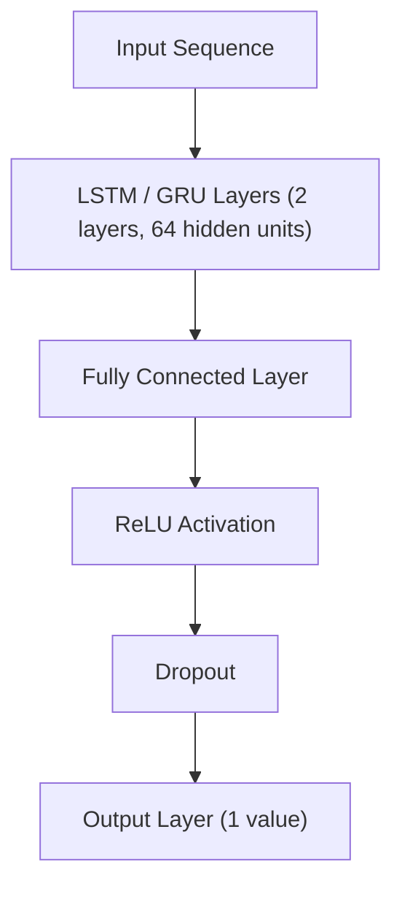

# 🔋 Multivariate Time-Series Prediction: Appliance Energy Consumption

## 📌 Project Overview
This project predicts **household appliance energy consumption (Wh)** using the Appliance Energy Prediction Dataset.

The solution combines:
- **Machine Learning models** (Linear Regression, Random Forest)
- **Deep Learning models** (LSTM, GRU)

The dataset consists of **10-minute interval time-series data**, including environmental, temporal, and sensor features.

---

## 🎯 Objective
To design an end-to-end pipeline that:
- Processes multivariate time-series data
- Engineers meaningful temporal features
- Trains baseline and deep learning models
- Optimizes performance using hyperparameter tuning

---

## 🔄 End-to-End Pipeline Flow

The project follows a rigorous machine learning lifecycle to ensure data integrity and model performance:



---
### 📂 Project Structure

```text
Energy_Prediction_Project/
├── data/
│   ├── raw/                
│   └── processed/         
├── models/
│   ├── trained_model.pth    
│   └── best_hyperparams.pkl 
├── reports/
│   ├── *plots
│   └── Energy Consumption Prediction _Report.pdf     
├── src/
│   ├── data_preprocessing.py 
│   ├── feature_engineering.py 
│   ├── model.py             
│   └── train.py              
├── requirements.txt       
└── README.md                          


```

## ⚙️ Technical Implementation

### 🔹 1. Data Preprocessing
- Time-based interpolation (no missing values originally)
- Outlier detection using **Z-score (analysis)** and **IQR (removal)**
- Time-based train-test split (80/20)
- Min-Max Scaling (features only)

---

### 🔹 2. Feature Engineering
- **Time Features**: hour, day_of_week, month, weekend
- **Lag Features**: lag_1, lag_2, lag_3, lag_6
- **Rolling Features**:
  - 1-hour rolling mean & std
  - 3-hour rolling mean
- **Domain Features**:
  - Peak hour indicator
  - Night indicator
- **Feature Selection**:
  - Random Forest importance (threshold = 0.006)

---

### 🔹 3. Modeling

#### ✔ Baseline Models
- Linear Regression
- Random Forest Regressor

#### ✔ Deep Learning Models
- LSTM (Long Short-Term Memory)
- GRU (Gated Recurrent Unit)

---

### 🔹 4. Model Architecture


👉 Output: **Predicted energy consumption (Wh)**

---

### 🔹 5. Optimization
- Grid Search:
  - Learning rates: 0.001, 0.0005
  - Hidden dimensions: 32, 64
  - Dropout: 0.2, 0.3
- Early Stopping (patience = 7)

---

## 📊 Final Results

| Model | MAE | RMSE | R² |
|------|-----|------|-----|
| Linear Regression | 8.83 | 12.83 | 0.7672 |
| Random Forest | ⭐ 8.17 | ⭐ 12.10 | ⭐ 0.7931 |
| Optimized LSTM | 10.18 | 15.39 | 0.6653 |
| Optimized GRU | 10.22 | 15.32 | 0.6685 |

---

## 🧠 Key Insights

- Random Forest outperformed deep learning models.
- Strong performance comes from:
  - Lag features
  - Rolling statistics
- Deep learning struggled due to:
  - Relatively small dataset (~20k records)
  - Strong tabular feature influence

---

## 📈 Visualizations
Generated plots include:
- Actual vs Predicted values
- Residual plots
- Training vs Validation loss
- Model comparison charts

(All plots are available in `/reports`)

---

## 🚀 How to Run

### 1. Install dependencies
```bash
pip install -r requirements.txt
```
2. Run the pipeline
python src/train.py

4. Output
Model performance printed in terminal
Plots saved in /reports
Final model saved in /models

🛠️ Tech Stack
- Python
- Pandas, NumPy
- Scikit-learn
- PyTorch
- Matplotlib

📌 Conclusion

This project demonstrates:
- End-to-end time-series modeling
- Feature-driven learning vs sequence learning
- Practical trade-offs between ML and Deep Learning

👨‍💻 Author
- Kesigan Mukuntharathan
